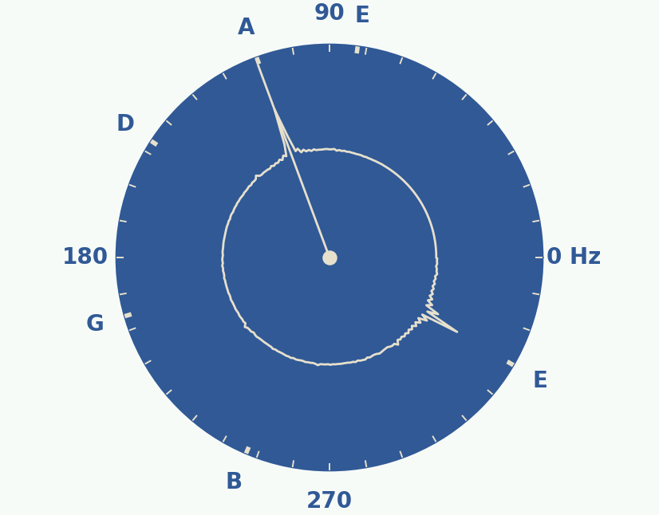

# GTuner
GTuner is a guitar tuner based on Python.

## Prerequisites
- pyaudio
- numpy
- scipy
- matplotlib

## Usage
Use `python main.py`, to run and press `q` to quite.

## Ref.

1. R., M. L., & Saji, A. K. (2009). A Digital Guitar Tuner.
2. [M. Z., (2016)](https://mzucker.github.io/2016/08/07/ukulele-tuner.html), Ukulele tuner. 
